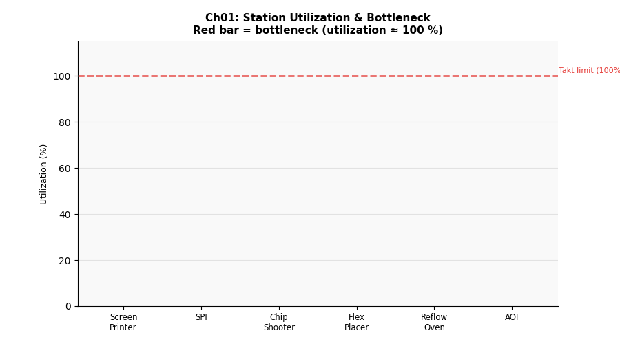

# 第一章　基礎產線分析：Takt Time 與 Little's Law




## 概念說明

製造現場最常被問到的問題是「我們夠快嗎？」**Takt Time（節拍時間）** 就是回答這個問題的量尺——它代表為了滿足客戶需求，每隔多少秒必須完成一個產品。

「Takt」源自德語，意為指揮家的「節拍」。若實際 Cycle Time 超過 Takt Time，代表產線跟不上客戶需求，交期將延誤；若遠低於 Takt Time，則可能存在過剩產能或浪費。

**Little's Law** 由 MIT 教授 John C.D. Little 於 1961 年嚴格證明，適用於任何穩定系統（工廠、銀行、急診室）：系統中的平均在製品數量永遠等於到達率乘以平均停留時間。這個定律讓管理者可以互推 WIP、吞吐量、流程時間三者的關係。

---

## 核心公式

### Takt Time

```
Takt Time (s) = 可用工時 (s) ÷ 客戶需求 (pcs)
              = 28,800 s  ÷  800 pcs
              = 36 s/pcs
```

- **可用工時**：一個班次 8 小時 = 28,800 秒
- **客戶需求**：100 pcs/hr × 8 hr = 800 pcs/班

### Little's Law

```
L = λ × W

L = 系統平均 WIP（在製品件數）
λ = 平均到達率（pcs/s）
W = 平均停留時間 / Flow Time（s）
```

**互推應用：**

| 已知 | 求 | 公式 |
|------|-----|------|
| λ、W | WIP | L = λ × W |
| L、W | 到達率 | λ = L ÷ W |
| L、λ | Flow Time | W = L ÷ λ |

### 產能判斷

```
實際 Cycle Time < Takt Time  →  ✓ 可滿足需求
實際 Cycle Time > Takt Time  →  ✗ 產能不足，需改善
```

---

## 產線實驗參數

| 站點 | 平均 Cycle Time | 備註 |
|------|----------------|------|
| 錫膏印刷 | 20 s | |
| SPI 檢測 | 15 s | |
| 高速機 | 8 s | |
| 泛用機 | 25 s | |
| 回焊爐 | 45 s | 6 槽並行，有效 CT ≈ 7.5 s |
| AOI 檢測 | 30 s | **理論瓶頸** |

- 進板間隔：Exp(μ = 28 s)
- 模擬時長：8 小時（含 1 小時暖機）

---

## 實驗設計

只執行一個情境（基準量測），目的是觀察：

1. 產線能否滿足 100 pcs/hr 的客戶需求
2. 實際瓶頸站點為何
3. Little's Law 在模擬結果中是否成立

---

## 如何執行

```bash
conda run -n smt_twin python chapters/ch01_takt_time/simulation.py
```

---

## 結果解讀

**預期輸出（seed=42）：**

```
Takt Time         36.0 s/pcs
實際 Cycle Time   ~35 s/pcs
實際產出率        ~102 pcs/hr  ✓ 達標
平均 WIP          ~100 pcs
瓶頸站點          aoi
```

**Takt Time vs Cycle Time：**
- Cycle Time < 36 s → 產線達標，有少許緩衝
- 若需求提升至 110 pcs/hr（Takt = 32.7 s），則需提升瓶頸產能

**Little's Law 驗算：**
```
WIP = (1/28) pcs/s × Cycle Time (s)
    ≈ 0.036 × ~35 × ~80（站點間等待放大）
```
模擬結果應與 Little's Law 估算接近，差異來自隨機波動與故障停機。

---

## 管理意涵

1. **Takt Time 是生產系統的「節拍器」**：不要追求最快，追求「剛好夠快」
2. **WIP 不是越多越好**：WIP 高 ↔ Flow Time 長 ↔ 問題被庫存隱藏
3. **瓶頸決定整線速度**：改善非瓶頸幾乎沒有效果（見第二章）
4. **Little's Law 的管理應用**：
   - 減少 WIP → 縮短交期（Flow Time）
   - 縮短 Flow Time → 更快速回應客戶變化

---

## 延伸閱讀

- 第二章：為什麼改善瓶頸才有效（TOC）
- 第六章：如何用 Kanban 控制 WIP 上限
