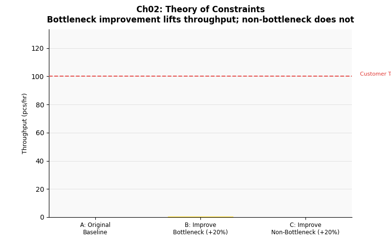

# 第二章　瓶頸分析：Theory of Constraints (TOC)




## 概念說明

木桶能裝多少水，由最短的那片板子決定——這就是 **Theory of Constraints（TOC，制約理論）** 的核心直覺。管理學家 Eliyahu Goldratt 在 1984 年的著作《目標》(The Goal) 中，將這個概念系統化為生產管理方法論。

在生產線中，**瓶頸（Bottleneck）** 是稼動率最高、等待佇列最長的那台設備。無論其他站點多快，整線的 Throughput 不可能超過瓶頸的最大產出。

### TOC 五步驟循環

| 步驟 | 行動 | 說明 |
|------|------|------|
| 1. 識別（Identify）   | 找出制約 | 哪台設備稼動率最高、最常有等待隊列？ |
| 2. 利用（Exploit）    | 最大化瓶頸 | 不增加資源，先確保瓶頸 100% 有效運轉 |
| 3. 遷就（Subordinate）| 配合瓶頸 | 非瓶頸站點配合瓶頸節奏，不必全速運轉 |
| 4. 提升（Elevate）    | 擴充瓶頸 | 仍不足時，才投資增加瓶頸產能 |
| 5. 回頭（Repeat）     | 找下一個 | 瓶頸解除後，下一個制約會浮現 |

---

## 核心公式

### 理論最大 Throughput（穩態，無故障）

```
TH_max = 1 ÷ max(有效 CT_各站)

有效 CT：
  錫膏印刷  20 s
  SPI       15 s
  高速機     8 s
  泛用機    25 s
  回焊爐    45 s ÷ 6 槽 = 7.5 s（管道模型）
  AOI       30 s   ← 理論瓶頸

TH_max = 1 ÷ 30 s ≈ 120 pcs/hr
```

### 稼動率（Utilization）

```
U = 忙碌時間 ÷ 總可用時間

瓶頸的 U 接近 100%，非瓶頸有閒置
```

### 改善效益法則

```
ΔTH（改善瓶頸）   ≫ 0   ← 顯著提升
ΔTH（改善非瓶頸） ≈ 0   ← 幾乎無效
```

---

## 產線實驗參數

本章改變的參數：

| 情境 | 改善對象 | 變更內容 |
|------|---------|---------|
| A | — | 原始產線（基準） |
| B | 高速機（chip_shooter） | Cycle Time × 0.8（提速 20%） |
| C | 泛用機（flex_placer） | Cycle Time × 0.8（提速 20%） |

高速機是模擬中稼動率最高的站點（瓶頸候選），泛用機則是非瓶頸。

---

## 實驗設計

**核心問題：** 改善瓶頸 vs 改善非瓶頸，誰對整體產出影響更大？

- **情境 B** 改善高速機（瓶頸） → 預期 Throughput 顯著提升
- **情境 C** 改善泛用機（非瓶頸） → 預期 Throughput 幾乎不變

若 TOC 正確，B 的效益應遠大於 C。

---

## 如何執行

```bash
conda run -n smt_twin python chapters/ch02_bottleneck/simulation.py
```

---

## 結果解讀

**預期輸出：**

```
情境                       產出率    vs 原始    瓶頸
A: 原始產線                102 pcs/hr   —       aoi
B: 改善瓶頸（高速機+20%）  118 pcs/hr  ＋16     aoi/flex_placer
C: 改善非瓶頸（泛用機+20%）102 pcs/hr  ＋0      aoi
```

**關鍵觀察：**
- B 提升了 ~15% Throughput（瓶頸解除，產出上升）
- C 幾乎沒有變化（泛用機本來就有閒置，縮短 CT 只增加更多閒置）
- B 改善後，瓶頸可能轉移到另一個站點（例如 flex_placer 或 AOI）

**稼動率長條圖解讀：**
- 紅色（>85%）= 高度緊繃，是瓶頸候選
- 黃色（60~85%）= 正常運轉
- 綠色（<60%）= 有餘裕，非瓶頸

---

## 管理意涵

1. **投資前先識別瓶頸**：買新機台前，先確認它是不是瓶頸；不是的話，買了也沒用
2. **非瓶頸不需要全速運轉**：讓非瓶頸閒置是正常且合理的，強迫其全速只會堆積 WIP
3. **瓶頸會移動**：一個瓶頸被解除後，下一個瓶頸會浮現，需持續執行 TOC 循環
4. **TOC + OEE 搭配使用**：先用 TOC 找到瓶頸，再用 OEE 分析該設備的損失來源（見第三章）

---

## 延伸閱讀

- 第一章：Takt Time 決定需要多少產能
- 第三章：找到瓶頸後，如何用 OEE 分析其損失
