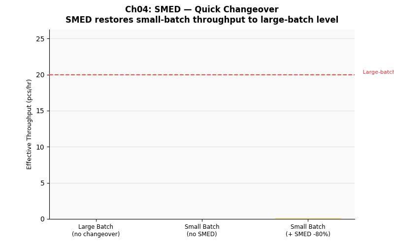

# 第四章　快速換線：SMED（Single Minute Exchange of Die）




## 概念說明

**換線（Changeover）** 是指生產線從生產某一機種切換到另一機種的過程，期間設備停止生產、人員進行調整作業。換線時間越長，代表設備的「有效生產時間」越短。

傳統應對策略是**大批量生產**：減少換線次數，讓每次換線的成本被攤薄在大批量上。但大批量帶來嚴重副作用：WIP 堆積、交期延長、彈性喪失——無法快速因應客戶需求變化。

**SMED（Single Minute Exchange of Die，單位分鐘換模）** 是豐田生產系統（TPS）的核心工具，由工業工程師新鄉重夫開發，目標是將換線時間縮短到 **10 分鐘以內**，讓小批量生產在經濟上可行。

### SMED 的核心方法

| 步驟 | 方法 | 說明 |
|------|------|------|
| 1. 分析 | 錄影分解換線動作 | 記錄每個動作的時間與類型 |
| 2. 分離 | 區分內部/外部作業 | 內部：機台停止才能做；外部：機台運行時就能準備 |
| 3. 轉換 | 將內部轉為外部 | 提前備料、預調治具，縮短停機時間 |
| 4. 縮短 | 同步化、標準化 | 多人協作、快速鎖緊工具、防呆設計 |

---

## 核心公式

### 換線損失計算

```
換線次數 = 總產量 ÷ 批量大小
換線損失時間 = 換線次數 × 換線時間

範例（8 小時班，生產 800 片，換線時間 30 分鐘）：
  大批量（50片）：800÷50 = 16 次 × 1,800 s = 28,800 s = 8 hr（幾乎整班都在換線！）
  → 實際模擬會按比例縮短，因為換線期間也有生產
```

### 本產線換線時間設定

| 站點 | 換線時間 |
|------|---------|
| 錫膏印刷 | 1,800 s（30 分鐘） |
| 高速機 | 2,400 s（40 分鐘，換料多） |
| 泛用機 | 3,000 s（50 分鐘） |
| 回焊爐 | 3,600 s（60 分鐘，換溫度 Profile） |

### SMED 效益

```
SMED 後換線時間 = 原始換線時間 × (1 - 改善率)

本實驗設定改善率 80%：
  泛用機 SMED 後：3,000 × 0.2 = 600 s（10 分鐘）
```

---

## 產線實驗參數

三個情境，對比批量大小與 SMED 的交互影響：

| 情境 | 批量大小 | 換線時間 | 換線次數（估計） |
|------|---------|---------|---------------|
| A | 50 片（大批量） | 正常 | 少 |
| B | 10 片（小批量） | 正常 | 多（約 5 倍） |
| C | 10 片（小批量） | SMED -80% | 多，但時間短 |

---

## 實驗設計

**核心問題：**
1. 小批量生產（B）是否因為換線頻繁而拖累產出？
2. SMED（C）能否讓小批量同時具備大批量的效率？

若 SMED 有效，C 的換線損失時間應與 A 相近，但具備 B 的彈性（小批量快速交貨）。

---

## 如何執行

```bash
conda run -n smt_twin python chapters/ch04_smed/simulation.py
```

---

## 結果解讀

**預期輸出：**

```
情境                          批量   換線損失(hr)   產出率
A: 大批量 50片，換線正常        50       0.8        102 pcs/hr
B: 小批量 10片，換線正常        10       3.2        88 pcs/hr
C: 小批量 10片 ＋ SMED(-80%)   10       0.6        101 pcs/hr
```

**關鍵觀察：**
- B 因換線頻繁，損失大量生產時間，產出率明顯下降
- C 導入 SMED 後，換線損失幾乎與大批量 A 一樣，但保留了小批量的彈性
- SMED 節省的換線時間（B-C 的差值）= 恢復的有效生產時間

---

## 管理意涵

1. **大批量不是省錢，而是掩蓋問題**：長換線時間會被大批量吸收，讓管理者忽視改善換線的必要性
2. **SMED 讓小批量成為可能**：縮短換線時間是實現「多機種混線」「快速交貨」的關鍵前提
3. **換線時間是可以被大幅縮短的**：新鄉重夫的案例顯示，換線從 3 小時縮短到 3 分鐘並非罕見
4. **SMED 的精神是「準備工作提前做」**：在機台還在生產時，下一次換線所需的料件、治具就已備妥

---

## 延伸閱讀

- 第六章：SMED 之後，搭配 Kanban 控制 WIP，實現真正的精實生產
- 第一章：換線損失時間會直接壓縮有效生產時間，影響 Takt Time 的達成
