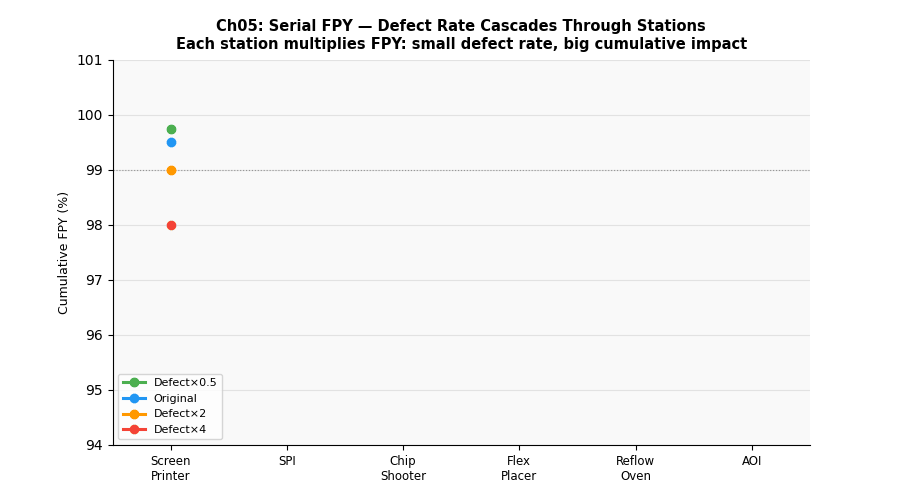

# 第五章　品質管理：FPY 串聯計算與 Rework Loop




## 概念說明

**FPY（First Pass Yield，首次通過良率）** 是衡量一個製程「一次就做對」的機率，是品質管理中最基本的指標。

在串聯製程中（上一站的輸出是下一站的輸入），整線 FPY 並非各站的平均，而是**各站 FPY 相乘**。這個「複利效應」讓多站製程的整體良率比直覺想像的更低：

```
整線 FPY = FPY₁ × FPY₂ × … × FPYₙ
```

**Rework Loop（返工迴路）** 是指不良品不直接報廢，而是送回某個站點重新加工的機制。返工雖然挽救了良品，但會：
- 增加 WIP（返工件佔用系統資源）
- 拉長 Cycle Time（返工件再次排隊等待）
- 降低瓶頸站點的有效產能

---

## 核心公式

### 串聯 FPY 計算

```
整線 FPY = ∏(1 - defect_rateᵢ)

本產線理論計算：
  錫膏印刷：1 - 0.005 = 99.5%
  SPI 檢測：1 - 0.000 = 100.0%  （只檢測，不產生不良）
  高速機：  1 - 0.002 = 99.8%
  泛用機：  1 - 0.003 = 99.7%
  回焊爐：  1 - 0.001 = 99.9%
  AOI 檢測：1 - 0.000 = 100.0%  （只檢測，不產生不良）

整線 FPY = 0.995 × 1.000 × 0.998 × 0.997 × 0.999 × 1.000 ≈ 98.9%
```

> **關鍵洞見**：每站看起來都很好（>99%），但整線只剩 98.9%——6 個站加起來有 ~1.1% 的不良率。站數越多，整線 FPY 越低。

### Rework 對 WIP 的影響

```
WIP增加量 = 返工件數 × 平均返工 Flow Time
          ≈ 總產量 × 返工率 × 返工站 Cycle Time × 等待倍率
```

### 不良率改善效益（複利效應）

| 改善方式 | 各站不良率 | 整線 FPY |
|---------|----------|---------|
| 原始 | 0.5%/0.2%/0.3%/0.1% | ~98.9% |
| 各站減半 | 0.25%/0.1%/0.15%/0.05% | ~99.45% |
| 各站加倍 | 1.0%/0.4%/0.6%/0.2% | ~97.8% |

---

## 產線實驗參數

本章改變的參數：

| 情境 | 變更內容 | 模擬意義 |
|------|---------|---------|
| A | 原始不良率 | 現況基準 |
| B | 各站不良率 × 0.5 | 導入 SPC、防呆設計後的品質改善 |
| C | 各站不良率 × 2.0 | 製程惡化（設備老化、操作問題） |

返工站：泛用機（`flex_placer`）——不良品在 AOI 後被攔截，送回泛用機重新過錫

---

## 實驗設計

**核心問題：**
1. 不良率改善/惡化對整線 FPY 的複利效應有多大？
2. 返工迴路如何影響 WIP 和 Cycle Time？
3. 理論 FPY（串聯公式）vs 實際模擬 FPY 是否吻合？

---

## 如何執行

```bash
conda run -n smt_twin python chapters/ch05_quality/simulation.py
```

---

## 結果解讀

**預期輸出：**

```
情境                  理論FPY%   實際FPY%   返工率%   平均WIP   產出率
A: 原始不良率          98.9%      98.6%      4.2%     102 pcs  102 pcs/hr
B: 不良率×0.5（改善）  99.45%     99.2%      2.1%      98 pcs  103 pcs/hr
C: 不良率×2（惡化）    97.8%      97.2%      8.4%     108 pcs  100 pcs/hr
```

**關鍵觀察：**
- 理論 FPY ≈ 實際 FPY（串聯公式有效）
- 品質惡化（C）→ 返工率上升 → WIP 增加 → Cycle Time 拉長 → 產出下降
- 品質改善（B）→ 連鎖正效益：WIP 下降、Cycle Time 縮短、產出略升

---

## 管理意涵

1. **每站品質都要顧**：串聯製程中，任何一站不良率惡化，整線 FPY 都受影響
2. **Rework 不是「免費」的**：看似挽救了不良品，實際上消耗了瓶頸產能、增加 WIP
3. **品質改善的複利效應**：各站各減 50% 不良率，整線 FPY 的提升幅度遠超過單站改善
4. **FPY 目標的設定**：業界 SMT 製程 FPY 目標通常 ≥ 99.5%，Six Sigma 追求 99.99966%
5. **根本解法是防呆（Poka-Yoke）**：不依賴檢驗攔截不良，而是讓不良根本不發生

---

## 延伸閱讀

- 第三章：品質損失（Quality）是 OEE 的三個維度之一
- 第六章：高 WIP 不只是成本問題，也代表更多不良品在製程中流動
