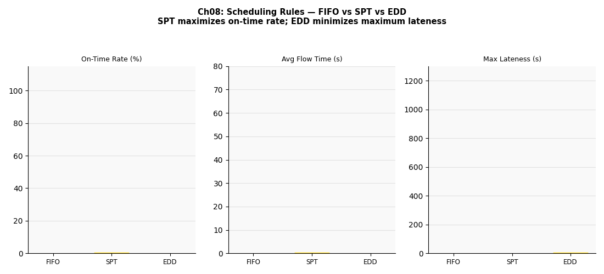

# 第八章　生產排程規則：FIFO / SPT / EDD




## 概念說明

當多種訂單同時在等待加工時，**排程規則（Scheduling Rule）**決定誰先被服務。  
這個看似小小的決策，對準時交貨率和平均等待時間有巨大影響。

三大經典排程規則：

| 規則 | 全名 | 邏輯 | 最優化目標 |
|------|------|------|-----------|
| **FIFO** | First In, First Out | 先到先服務 | 公平，但兩者都不是最優 |
| **SPT** | Shortest Processing Time | 加工時間短的先做 | 最小化**平均等待時間** |
| **EDD** | Earliest Due Date | 交期最近的先做 | 最小化**最大延誤** |

> **重要理論結果（Johnson's Rule 推論）**：
> - SPT 在單機環境下，必定產生最小平均流程時間（Average Flow Time）
> - EDD 在單機環境下，必定產生最小最大延誤（Maximum Lateness）
> - 沒有任何規則能同時最優化兩個目標

---

## 核心公式

### 平均流程時間（Average Flow Time）

```
F̄ = (1/n) × Σ Fᵢ

其中 Fᵢ = Cᵢ - rᵢ（完工時間 - 到達時間）
SPT 排序可證明使 F̄ 最小
```

### 延誤（Tardiness）

```
Tᵢ = max(0, Cᵢ - dᵢ)     ← 只計正延誤

最大延誤：T_max = max(Tᵢ)
平均延誤：T̄ = (1/n) × Σ Tᵢ

EDD 排序可證明使 T_max 最小
```

### 稼動率（影響規則效果的關鍵）

```
ρ = λ × E[S]

本實驗：λ = 1/28 s⁻¹，E[S] ≈ (12+22+35)/3 × 加權 ≈ 21.2 s
ρ ≈ 0.86（高負載，排程規則效果最顯著）
```

---

## 產線實驗參數

| 機種 | 加工時間（均值） | 交期視窗 | 占比 |
|------|---------------|---------|------|
| A 急單 | 12 s（短） | 到達後 80 s | 40% |
| B 一般 | 22 s（中） | 到達後 130 s | 40% |
| C 長單 | 35 s（長） | 到達後 110 s | 20% |

> **設計重點**：C 型工件加工最長（35 s），但交期不是最寬鬆（110 s < A 的 80 s + 35 s margin）。  
> 這使 SPT vs EDD 之間產生**真正的取捨**：  
> - SPT 將 C 推到隊列最後（C 最容易遲到）  
> - EDD 在 C 的交期快到時優先處理 C（C 準時率提升，A/B 略受影響）

---

## 如何執行

```bash
conda run -n smt_twin python chapters/ch08_scheduling/simulation.py
```

---

## 結果解讀

**預期輸出：**

```
排程規則   完工數   平均延誤(s)   最大延誤(s)   整體準時率   平均流程時間(s)
FIFO       ~740      ~15           ~250          ~82%          ~85
SPT        ~740       ~8           ~290          ~86%          ~60  ← 平均最短
EDD        ~740      ~12           ~190          ~89%          ~75  ← 準時率最高
```

**各機種準時率（關鍵觀察）：**

```
         A(急/短)   B(一般)   C(長/中緊)
FIFO      ~88%       ~85%      ~65%
SPT       ~96%       ~90%      ~55%  ← C 被犧牲
EDD       ~92%       ~88%      ~82%  ← C 大幅改善
```

**關鍵觀察：**
- SPT 平均流程時間最短，但 **C 型工件準時率最差**（長工件被不斷插隊，可能無限等待 → Starvation）
- EDD 整體準時率最高，各型工件較均衡，**最大延誤也最小**
- FIFO 公平，但在高負載下整體表現最差

---

## 管理意涵

1. **沒有萬能排程規則**：需根據企業的績效目標選擇
   - KPI = 平均交期達成率 → EDD
   - KPI = 平均 Lead Time 最短（客戶服務水準） → SPT
   - KPI = 公平性（避免長工件飢餓） → FIFO 或加入優先保護機制

2. **SPT 的 Starvation 問題**：若系統負載高，長工件可能永遠排不到（大型複雜 PCB 被無限插隊）
   - 實務解法：加入**老化機制（Aging）**，等待越久的工件優先級越高

3. **EDD 的前提**：需要準確的交期資訊——若交期不準確，EDD 效果大打折扣

4. **SMT 產線應用**：  
   - 混線生產（多機種）時，應依訂單交期排板順序（EDD 精神）
   - 換線成本考量時，需在 EDD 和同機種批量之間取捨

---

## 延伸閱讀

- 第二章：瓶頸站是排程效果最顯著的地方（TOC：要管好瓶頸的隊列）
- 第四章：SMED 縮短換線後，小批量 EDD 才真正可行
