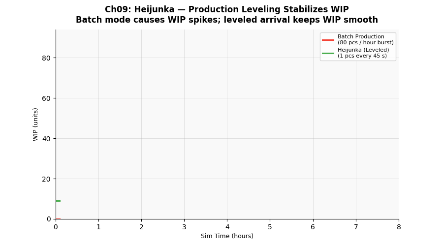

# 第九章　Heijunka 均衡生產




## 概念說明

現實中客戶訂單往往集中到達——週一大量、週五少量，或每天一次大批到料。  
若工廠採**批量推送（Batch Push）**直接反應訂單節奏：

- 訂單大量到達時 → WIP 暴增 → 回焊爐前大排長龍 → Cycle Time 拉長
- 訂單稀少時 → 產線閒置 → WIP 歸零 → 資源浪費

**Heijunka（平準化）** 的做法：不管訂單何時到，工廠按固定節拍均勻生產。  
接到 100 片訂單，不一次投入，而是每隔 T 秒投入一片（T = 可用時間 ÷ 需求量）。

> 「工廠的生產節奏由 Takt Time 決定，不由客戶訂單的波動決定。」

---

## 核心公式

### 均衡進板間隔

```
均衡間隔 = 班別可用時間 ÷ 需求量

範例（本章）：
  需求量        = 80 片/hr
  班別可用時間  = 3,600 s/hr
  均衡間隔      = 3,600 ÷ 80 = 45 s/片
```

### WIP 波動與 Little's Law

```
WIP = λ × CT（Little's Law）

批量模式：λ 在批量到達時瞬間增大 → WIP 峰值極高
均衡模式：λ 穩定 = Takt Time 節拍 → WIP 穩定

WIP 穩定 → CT 穩定 → 交期可預測
```

### 均衡的附帶效益

```
WIP 降低 → CT 縮短（Little's Law）
問題更快被發現（不良品在高 WIP 中被淹沒）
換線計畫更容易安排（知道每個時段要做什麼）
```

---

## 產線實驗參數

| 情境 | 進板方式 | 說明 |
|------|---------|------|
| A | 批量（每小時集中 80 片） | 前 40 秒密集放板，其餘 3560 秒等待 |
| B | 均衡（每 45 秒 1 片） | Heijunka 平準化 |

兩種情境的**總需求量相同**（80 pcs/hr × 7 hr 有效 = 560 片），  
差異僅在進板節奏。

---

## 如何執行

```bash
conda run -n smt_twin python chapters/ch09_heijunka/simulation.py
```

---

## 結果解讀

**預期輸出：**

```
情境                   產出率     平均WIP   WIP標準差   WIP峰值   平均CT(s)  CT標準差
A: 批量（每小時集中）   ~80 pcs/hr  ~50 pcs    ~35         ~100      ~2500 s    ~800
B: 均衡（Heijunka）    ~80 pcs/hr  ~25 pcs    ~10          ~50      ~1200 s    ~200
```

**關鍵觀察：**
- 產出率幾乎相同——Heijunka 不是用來增產，而是**穩定流動**
- WIP 標準差大幅降低 → WIP 不再劇烈震盪
- WIP 峰值降低 → 回焊爐前不再大排長龍
- Cycle Time 標準差降低 → **交期變得可預測**（這才是客戶真正在乎的）

---

## 管理意涵

1. **Heijunka 不是讓工廠生產更多，而是讓生產更穩定**：穩定的流動才能支撐精實改善

2. **均衡的前提是小批量**（搭配第四章 SMED）：
   - 批量大 → 必須一次做完 → 無法均衡
   - 批量小（甚至 1 片）→ 可以隨時插入 → 真正均衡

3. **與客戶溝通交期節奏**：有時候問題出在客戶下單方式——協商更均勻的訂單節奏，比工廠內部平準化更有效

4. **Heijunka Box（平準化箱）實體化**：  
   - 把每個時段要生產的 Kanban 卡插入對應的格子
   - 生產線工人依格子順序生產，不依訂單大小批量

5. **WIP 穩定的連鎖效益**：
   - 品質問題更快暴露（不被大量庫存掩蓋）
   - 設備保養時間更好安排
   - 物料消耗更平穩（採購更容易預測）

---

## 延伸閱讀

- 第一章：Takt Time 是均衡生產的節拍基準
- 第四章：SMED 讓換線時間縮短，才能把批量縮小到可均衡的程度
- 第六章：Kanban 拉式系統與 Heijunka 搭配，才能真正實現 Just-in-Time
