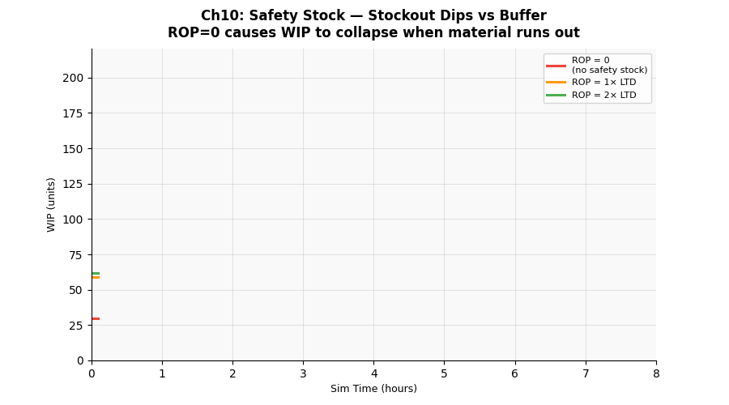

# 第十章　安全庫存與補料策略




## 概念說明

生產線需要原物料才能運作。當庫存耗盡而補料還沒到，產線被迫**斷料停機**——  
這是一種純粹的浪費，完全可以透過合理的庫存策略避免。

**再訂購點（ROP, Reorder Point）**：當庫存水位降到此點時，立刻下訂單。  
**安全庫存（Safety Stock, SS）**：在「前置時間期望需求」之上額外備存的緩衝，  
用來對抗補料時間內的需求不確定性。

```
ROP = 前置時間期望需求 + 安全庫存
    = LTD + SS

LTD（Lead Time Demand）= 補料前置時間 × 平均需求率
```

**直覺理解**：

> 如果下單後 30 分鐘才到料，而你每分鐘用掉 2 片，  
> 那 ROP = 60 片（確保到料前不斷貨）。  
> 安全庫存再加 30 片，就算補料延誤或需求突然增加，也不會斷料。

---

## 核心公式

### 前置時間期望需求（LTD）

```
LTD = L × d

L = 補料前置時間（s）
d = 平均需求率（片/s）

本實驗：
  L = 1,800 s（30 分鐘）
  d = 1 ÷ 28 ≈ 0.036 片/s
  LTD = 1,800 × 0.036 ≈ 64 片
```

### 安全庫存計算（統計公式）

```
SS = Z × σ_d × √L

Z    = 服務水準對應的標準常態分位數（如 95% → Z=1.65）
σ_d  = 需求標準差
L    = 前置時間（與需求同單位）

本實驗簡化為倍數法：SS = k × LTD（k=0, 1, 2）
```

### 庫存成本 vs 斷料損失

```
持有成本 = 平均庫存量 × 單位持有成本率
斷料損失 = 斷料次數 × 每次停機損失

最佳 SS：使 持有成本 + 斷料損失 最小化
```

---

## 產線實驗參數

| 情境 | 安全庫存 | 再訂購點 | 說明 |
|------|---------|---------|------|
| A | 0 片（SS=0） | ROP=0 | 庫存見底才下單，無緩衝 |
| B | 1x LTD（≈64 片） | ROP=64 | 恰好覆蓋前置時間需求 |
| C | 2x LTD（≈128 片） | ROP=128 | 額外 1x LTD 安全緩衝 |

補料參數：
- 訂購量：120 片/次
- 前置時間：30 分鐘（1,800 s）
- 初始庫存：100 片（不同情境同樣的起始條件）

---

## 如何執行

```bash
conda run -n smt_twin python chapters/ch10_safety_stock/simulation.py
```

---

## 結果解讀

**預期輸出：**

```
情境                      安全庫存  ROP   斷料次數  斷料停機   產出率
A: 無安全庫存（ROP=0）      0       0      ~5次     ~25 min   ~98 pcs/hr
B: 安全庫存 1x（ROP=LTD）  ~64     ~64    ~1次      ~5 min    ~101 pcs/hr
C: 安全庫存 2x（ROP=2×LTD）~128   ~128    0次       0 min     ~102 pcs/hr
```

**關鍵觀察：**
- 情境 A：頻繁斷料，產出率明顯下降
- 情境 B：偶發斷料（補料延誤或需求波動超過預期時），大幅改善
- 情境 C：近乎零斷料，產出率接近理論值
- 代價：情境 C 的庫存持有量（≈128 片）是情境 A 的兩倍，佔用更多資金

---

## 管理意涵

1. **安全庫存是保險費，不是浪費**：沒有安全庫存的斷料損失（停機、延誤訂單）遠大於持有少量庫存的成本

2. **ROP 的設定需考慮需求波動**：本實驗假設需求穩定，實際上需求有隨機波動，需加入統計安全庫存公式

3. **供應商交期越不穩定，安全庫存越高**：
   - 穩定供應商（Lead Time 短且準時） → 低安全庫存
   - 不穩定供應商（Lead Time 長且不準）→ 高安全庫存

4. **供應鏈視野**：安全庫存不只在工廠，每個節點（成品倉、半成品、原料）都有其最佳安全庫存量

5. **精實觀點 vs 安全庫存**：
   - 精實生產追求「消除庫存」，但這不代表安全庫存是零
   - 正確做法是「降低需求波動和供應不確定性」，讓安全庫存**自然縮小**，而不是強制設為零

---

## 延伸閱讀

- 第六章：Kanban 控制線上 WIP，安全庫存控制進線前的原料緩衝——兩者各司其職
- 第九章：Heijunka 均衡需求，可降低 σ_d，從而縮小所需安全庫存
