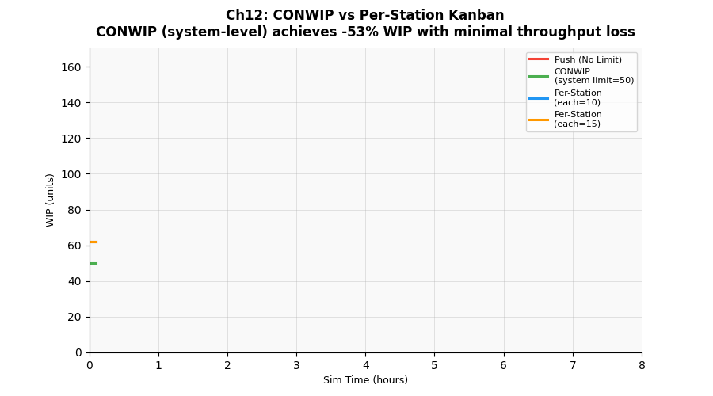

# 第十二章　CONWIP vs 逐站 Kanban




## 概念說明

第六章介紹了**系統級 WIP 上限**——一張全域卡片控制整條線的在製品數量，  
這正是 **CONWIP（Constant WIP）** 的核心思想。

本章進一步比較三種策略：

| 策略 | 控制方式 | 信號來源 |
|------|---------|---------|
| **Push** | 無上限，上游持續生產 | 排程（推送） |
| **CONWIP** | 一張全域 WIP 卡 | 最終出口（完工才釋放） |
| **逐站 Kanban** | 每站各自上限 | 下游空位（站間拉式訊號） |

**CONWIP vs 逐站 Kanban 的根本差異：**

```
CONWIP：
  PCB 進板前等「全線有空位」→ 信號來自最末站
  優點：實作極簡（一個計數器）
  缺點：無法感知哪站壅塞，只知道「線上太多片了」

逐站 Kanban：
  PCB 進每站前等「該站有空位」→ 每站發出獨立信號
  優點：局部壅塞立即顯現（某站滿了 → 上游自動停等）
  缺點：每站需獨立設定，管理複雜度高 6 倍
```

---

## 核心公式

### CONWIP 的 WIP 上限設定

```
推薦初始值 ≈ 2 × 理論最小 WIP

理論最小 WIP = Σ(每站 cycle time) × Throughput
本產線：(20+15+8+25+45+30) s × (102/3600) pcs/s ≈ 41 片

推薦上限：50 片（理論值 ×1.2，保留緩衝）
```

### 逐站 Kanban 的每站上限設定

```
每站上限 ≈ (station CT / Takt Time) × 緩衝係數

高速機（CT=8s, Takt=36s）：最小需 1 片，建議 3-5 片
泛用機（CT=25s, Takt=36s）：最小需 1 片，建議 5-8 片

實務上各站通常設相同值（簡化管理），本實驗用 10/15 片
```

---

## 產線實驗參數

| 情境 | 策略 | 參數 |
|------|------|------|
| A | Push（無限制） | — |
| B | CONWIP | 系統上限 = 50 片 |
| C | 逐站 Kanban | 每站上限 = 10 片 |
| D | 逐站 Kanban | 每站上限 = 15 片 |

情境 C/D 總理論上限 = 10/15 × 6 站，但因站間串聯，實際 WIP 遠低於理論最大值。

---

## 如何執行

```bash
conda run -n smt_twin python chapters/ch12_conwip/simulation.py
```

---

## 結果解讀

**預期輸出：**

```
情境                    產出率      平均WIP   平均CT(s)   FPY%
A: Push（無限制）        102 pcs/hr  101 pcs   3095 s      99.0%
B: CONWIP（上限=50）     102 pcs/hr   47 pcs   1559 s      99.2%
C: 逐站 Kanban（每站=10）98 pcs/hr   38 pcs   1390 s      99.1%  ← 太緊
D: 逐站 Kanban（每站=15）101 pcs/hr  55 pcs   1930 s      99.1%
```

**WIP / CT 降幅：**

```
B: CONWIP     WIP -53%  CT -50%  Throughput ≈ 持平
C: 逐站(10)   WIP -62%  CT -55%  Throughput -4%  ← 部分站太緊，流動受阻
D: 逐站(15)   WIP -45%  CT -38%  Throughput ≈ 持平
```

**關鍵觀察：**
- CONWIP 和逐站 Kanban 都能大幅降低 WIP 和 CT
- 逐站 Kanban 每站=10 太緊（6 站串聯，阻塞效應累積），Throughput 下降
- 逐站 Kanban 每站=15 效果接近 CONWIP，但設定複雜 6 倍
- CONWIP 是**最簡單的 Pull 系統起點**

---

## 管理意涵

1. **先用 CONWIP，再考慮逐站 Kanban**：  
   CONWIP 能達到 80% 的效果，且設定和維護成本遠低於逐站 Kanban

2. **逐站 Kanban 的優勢在「問題可視化」**：
   - 某站前堆了很多 PCB → 那站是瓶頸，立即可見
   - CONWIP 只知道「線上太多了」，不知道卡在哪裡
   - 逐站 Kanban 讓問題「自動浮現」（精實思想的核心）

3. **每站 Kanban 數量需要調整**：
   - 初期設寬鬆（高緩衝），觀察哪站最常滿
   - 每隔一段時間減少一張，直到 Throughput 開始下降
   - 找到臨界點後，設在略高於臨界點的位置

4. **CONWIP 適合哪種環境**：
   - 產品組合多樣、路徑複雜（不是單一流程）
   - 管理資源有限，需要簡單易懂的規則
   - 改善初期，從 Push 轉型 Pull 的第一步

5. **逐站 Kanban 適合哪種環境**：
   - 產線穩定、產品路徑固定（如本 SMT 線）
   - 有足夠的改善人員維護看板系統
   - 對問題可視化有高度要求

---

## 延伸閱讀

- 第六章：CONWIP 的深入分析（不同上限值對 WIP/Throughput 的取捨）
- 第二章：逐站 Kanban 讓瓶頸立即可見，搭配 TOC 改善更有效率
