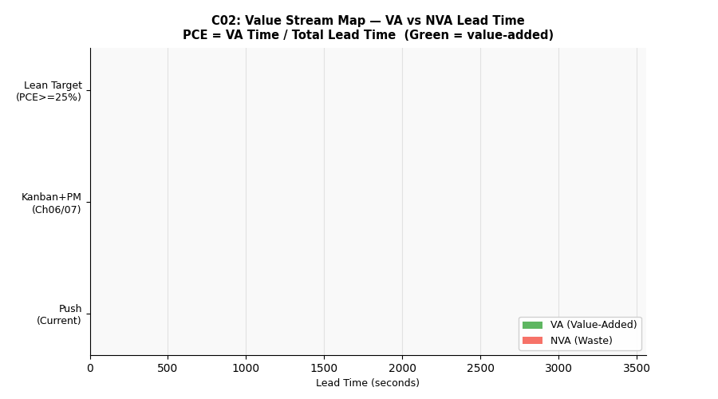

# C02：Value Stream Mapping（VSM）價值流圖分析




## 概念說明

VSM 是精實製造的**靜態分析工具**，用於繪製從「訂單到出貨」的完整流程，
識別哪些活動創造價值（VA）、哪些是浪費（NVA）。

核心指標：
- **VA 時間（Value-Added）**：純加工時間（不可壓縮）
- **NVA 等待（Non-Value-Added）**：佇列等待 + 故障停機 + 換線
- **PCE（Process Cycle Efficiency）**= VA / Total Lead Time

業界標竿：一般製造業 PCE 約 5–10%，精實目標 ≥ 25%

## 為什麼不用 SimPy？

VSM 是**一次性快照分析**，用現有數據計算當前狀態。
改善前後的對比使用不同參數組合計算即可，不需要時間維度模擬。

（對比：Ch06 Kanban 使用 SimPy 模擬 WIP 隨時間的動態變化）

## 工具功能

```
python concepts/c02_vsm/calculator.py
```

輸出三個表格：
1. **各站 VSM 數據**：CT、稼動率、不良率、進站前 WIP、VA vs NVA 佔比
2. **VSM 改善比較**：Push（現況）→ Kanban（Ch06）→ 精實目標
3. **NVA 來源對應改善工具**

## SMT 產線 VSM 數據

| 站點 | CT(s) | 進站前WIP | 等待(s) |
|------|-------|---------|--------|
| 錫膏印刷 | 20 | 5 | 180 |
| SPI | 15 | 3 | 108 |
| 高速機 | 8 | 8 | 288 |
| 泛用機 | 25 | 6 | 216 |
| 回焊爐 | 45 | 4 | 144 |
| AOI | 30 | 3 | 108 |

**VA 時間固定 = 143 s（純加工）**

## 改善路徑

| 狀態 | Lead Time | PCE |
|------|-----------|-----|
| 現況（Push） | 3,095 s | 4.6% |
| 改善後（Kanban+PM） | 1,559 s | 9.2% |
| 精實目標（PCE≥25%） | ≤ 572 s | 25% |

## NVA 來源 → 對應工具

| NVA 類型 | 改善工具 | 對應章節 |
|---------|---------|---------|
| 佇列等待 | Kanban 限制 WIP | Ch06 |
| 故障停機 | PM 預防保養 | Ch07 |
| 換線時間 | SMED | Ch04（概念）|
| 返工時間 | SPC 製程管制 | Ch11 |
