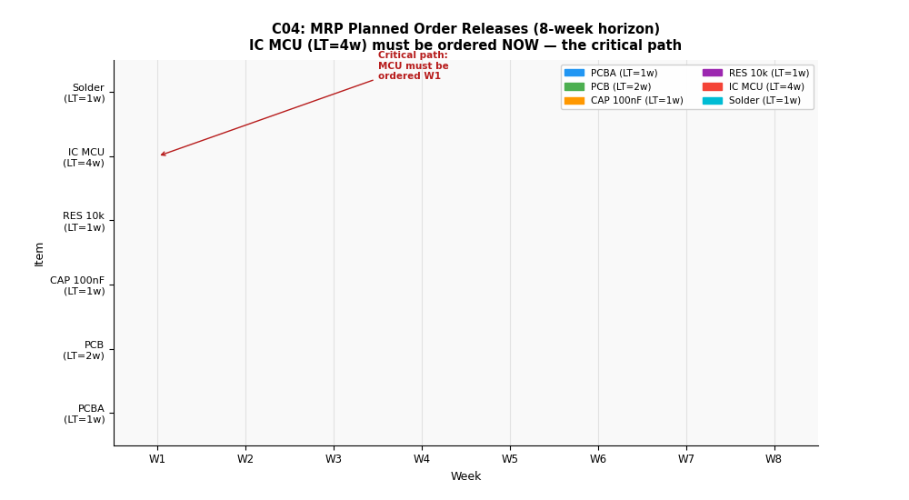

# C04：MRP 物料需求計畫




## 概念說明

MRP（Material Requirements Planning）解決「**什麼時候需要多少料？**」，
透過三步驟計算：

1. **BOM 展開**：從成品需求展開所有子件需求
2. **淨需求計算**：毛需求 − 在手庫存 − 在途訂單
3. **計畫訂單**：批量化淨需求，考慮前置時間往前推排程

### 關鍵公式

```
毛需求（Gross Requirement）= 來自 MPS 或父階計畫發出
預計在手（Projected On Hand）= 上期在手 + 預計到貨 + 計畫收貨 − 毛需求
淨需求（Net Requirement）= max(毛需求 − 預計在手, 0)
計畫收貨（Planned Receipt）= ceil(淨需求 / 批量) × 批量
計畫發出（Planned Release）= 計畫收貨 往前推 前置時間 週
```

## 為什麼不用 SimPy？

MRP 是**批次計算工具**（通常每晚跑一次），
輸入是固定的 BOM + MPS + 庫存數據，輸出是採購/生產指令。
不涉及隨機事件或連續時間流，不需要模擬。

（對比：Ch10 Safety Stock 使用 SimPy 模擬採購前置時間的不確定性）

## 工具功能

```
python concepts/c04_mrp/calculator.py
```

輸出：
1. **MPS（主生產計畫）**：8 週的成品需求
2. **各物料 MRP 展開**：毛需求、預計到貨、計畫收貨、預計在手、計畫發出
3. **關鍵路徑分析**：最長前置時間物料的緊急度

## SMT PCBA BOM 結構

```
PCBA（成品）
├── PCB 裸板       ×1   [LT=2週, LS=200片]
├── 電容 100nF    ×20   [LT=1週, LS=1000個]
├── 電阻 10kΩ     ×15   [LT=1週, LS=1000個]
├── IC MCU        ×1    [LT=4週, LS=50片]   ← 關鍵路徑
└── 焊錫膏        ×0.5瓶 [LT=1週, LS=10瓶]
```

## 8 週 MPS

| W1 | W2 | W3 | W4 | W5 | W6 | W7 | W8 |
|----|----|----|----|----|----|----|-----|
| 0  | 200 | 150 | 300 | 200 | 250 | 200 | 300 |

## 關鍵洞察

**MCU 芯片（前置時間 4 週）是供應鏈瓶頸：**
- W2 需要 200 片成品 → 需要 200 顆 MCU
- MCU LT=4 週 → 必須在 W(2-4)= **W1 之前** 發出採購單
- 若已逾期：需要 **框架合約** 或 **安全庫存** 緩衝

## MRP → ERP 演進

| 版本 | 範圍 | 工具 |
|------|------|------|
| MRP I | 物料計畫 | 本工具 |
| MRP II | 物料 + 產能計畫（CRP） | 加入機台 / 人力約束 |
| ERP | 全企業整合 | SAP, Oracle, Microsoft Dynamics |

## 與其他概念的關係

- **EOQ（C03）**：決定單品項的最佳批量（LS）→ 輸入給 MRP
- **VSM（C02）**：MRP 的計畫期長度由 Lead Time 決定
- **Safety Stock（Ch10）**：MRP 中的 SS 緩衝不確定需求
