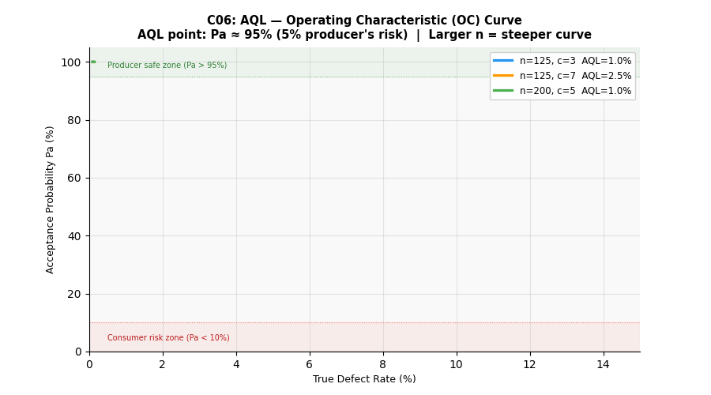

# C06：AQL 抽樣計畫




## 概念說明

AQL（Acceptable Quality Level）定義**可接受的最大平均不良率**，
是買賣雙方約定的品質保護機制。

ANSI/ASQ Z1.4 標準提供查表法：
```
批量大小 → 樣本代字（A~Q）→ 樣本數 n、允收數 c、拒收數 r
```

- **允收（Accept）**：抽樣中不良數 ≤ c → 整批放行
- **拒收（Reject）**：抽樣中不良數 ≥ r → 整批退回

## 為什麼不用 SimPy？

AQL 是**一次性抽樣決策**的靜態計算，
OC 曲線（Operating Characteristic）也是基於二項分布的解析解。

不需要模擬時間流逝，只需計算「給定不良率 p，抽樣方案的允收機率 Pa(p)」。

## 工具功能

```
python concepts/c06_aql/calculator.py
```

輸出：
1. **不同批量 / AQL 的抽樣方案**：n、c、r、抽樣比例
2. **OC 曲線**：批量 3200，AQL=1.0%，各不良率對應允收機率

## OC 曲線（Operating Characteristic Curve）

OC 曲線橫軸為實際不良率，縱軸為允收機率 Pa：

| 實際不良率 | 允收機率 Pa | 風險說明 |
|---------|-----------|---------|
| 0.1% | ~100% | 優良品，幾乎必過 |
| 1.0% | ~95% | AQL 點：供應商風險 5% |
| 2.5% | ~57% | LTPD 區：消費者開始面臨風險 |
| 5.0% | ~7% | 高不良率：幾乎確定拒收 |
| 10.0% | ~0% | 嚴重不良：必定拒收 |

## 雙方風險

- **生產者風險（Alpha/Type I）**：良好批量被拒收的機率
  - 通常設定 ≤ 5%，即 AQL 點的 Pa ≈ 95%
- **消費者風險（Beta/Type II）**：不良批量被允收的機率
  - LTPD（Lot Tolerance Percent Defective）處控制在 10%

## 各批量抽樣方案（AQL=1.0%）

| 批量 | 代字 | 樣本數 n | 允收數 c | 抽樣比例 |
|------|------|---------|---------|---------|
| 200 | G | 32 | 1 | 16% |
| 500 | H | 50 | 1 | 10% |
| 1,200 | J | 80 | 2 | 6.7% |
| 3,200 | K | 125 | 3 | 3.9% |

批量越大，抽樣比例越低，但絕對樣本數越多。

## SMT 出貨建議

| 產品類型 | 建議 AQL | 抽樣強度 |
|---------|---------|---------|
| 外觀板 | 2.5% | Normal（一般）|
| 功能板 | 1.0% | Normal |
| 車用 / 醫療 | 0.65% | Tightened（加嚴）|

## 與 SPC（Ch11）的關係

- **AQL（本工具）**：出廠**批次**檢驗，決策是放行或退貨
- **SPC（Ch11）**：製程**即時**監控，偵測漂移並在批量完成前介入

AQL 是最後一道防線，SPC 是在源頭預防不良品產生。
